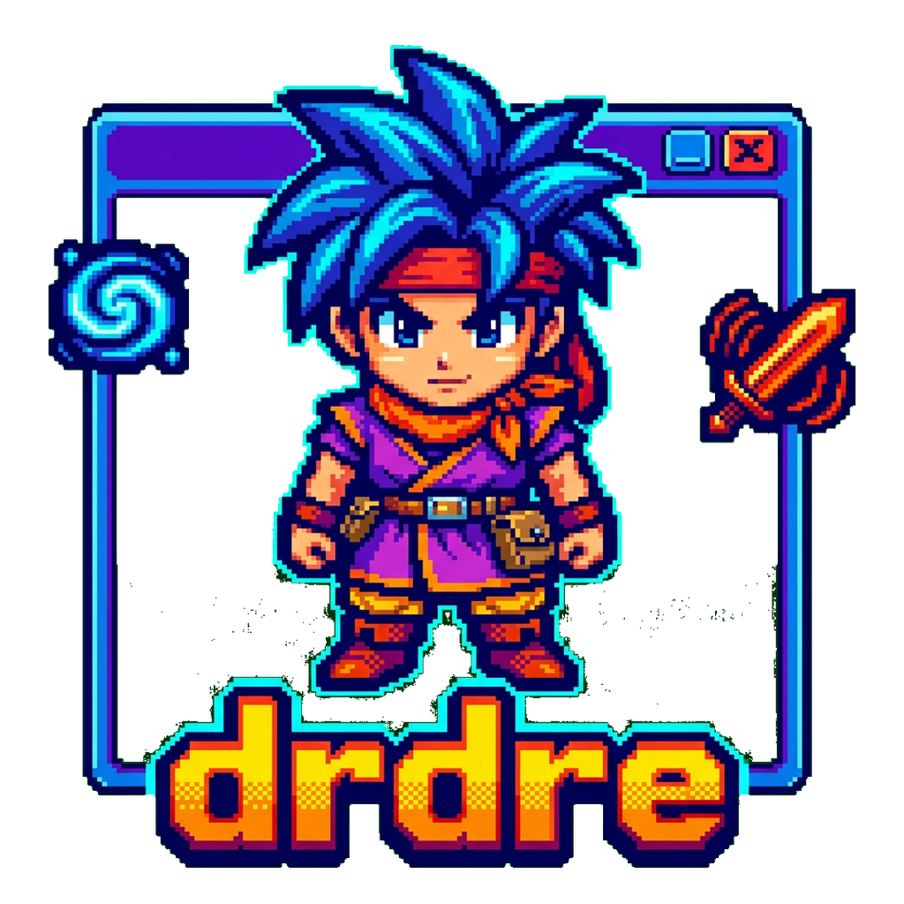
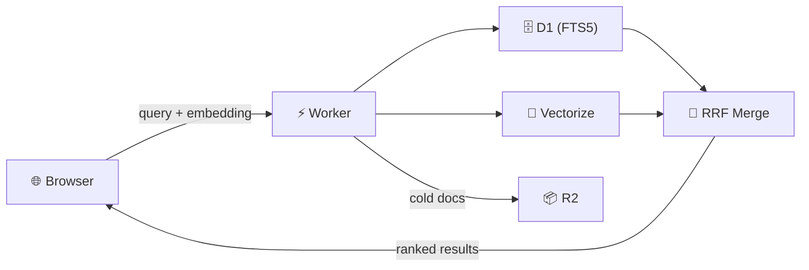

<div align="center">
  

  # drdre

  **Diário da República Retrieval Engine**

  🔍 Hybrid semantic search for Portugal's Diário da República — free-tier Cloudflare + Vercel, browser-side embeddings, zero ongoing server cost 🇵🇹

  [](https://www.typescriptlang.org/)
  [](https://nextjs.org/)
  [](https://workers.cloudflare.com/)
  [](https://vercel.com/)

</div>

## 🤔 Why DR.DRE?

**The Pain:** Portugal's official Diário da República search is keyword-only — noisy results, no semantic understanding, and no way to search by meaning. Alternatives require paid APIs or expensive server-side ML inference.

**The Solution:** DR.DRE combines FTS5 full-text search with semantic vector search using Reciprocal Rank Fusion (RRF). The browser generates embeddings client-side with `multilingual-e5-small` — no server-side inference cost. Everything runs on Cloudflare and Vercel free tiers.

**The Result:** Search that understands both exact legal citations and natural language queries like "regras para construção em zonas protegidas", hosted for zero ongoing cost.

## 🏗️ Architecture

### Monorepo Layout

| Workspace | Path | Description | Deploys to |
|-----------|------|-------------|------------|
| `@drdre/web` | `apps/web` | Next.js 15 search UI with client-side embedding | Vercel |
| `@drdre/worker` | `apps/worker` | Hybrid search API over D1 + Vectorize | Cloudflare Workers |
| `@drdre/shared` | `packages/shared` | Shared types, embedding wrapper, RRF logic | — |
| `@drdre/builder` | `packages/builder` | CLI tool: download, normalize, embed, sync | Local |

### Search Flow



### Key Design Decisions

- **Hybrid search** — RRF (K=60) merges FTS5 keyword results with semantic vector results for best-of-both-worlds ranking
- **Browser-side embeddings** — `@xenova/transformers` runs `multilingual-e5-small` (384-dim) in the browser, eliminating server-side inference
- **Hot/cold split** — last 24 months of vectors live in Vectorize for semantic search; older documents remain searchable via FTS5
- **Graceful degradation** — if Vectorize is unavailable, the Worker automatically falls back to FTS-only search
- **Edge caching** — search results cached for 300s at the edge, configurable via `SEARCH_CACHE_TTL_SECONDS`

## 🚀 Quick Start

```bash
git clone https://github.com/tsilva/drdre.git && cd drdre
npm install
npm run dev:worker   # API on :8787
npm run dev:web      # UI on :3000
```

> **Note:** Search returns empty results until data is ingested. See [Data Ingestion](#-data-ingestion) below.

## ☁️ Deployment

### Cloudflare Worker

1. **Create resources:**
   ```bash
   npx wrangler login
   npx wrangler d1 create drdre-catalog
   npx wrangler r2 bucket create drdre-documents
   npx wrangler vectorize create drdre-hot --dimensions=384 --metric=cosine
   ```

2. **Update config** — edit `apps/worker/wrangler.toml` with the returned `database_id`

3. **Apply schema:**
   ```bash
   npx wrangler d1 execute drdre-catalog --file apps/worker/migrations/0001_init.sql
   ```

4. **Set admin secret:**
   ```bash
   npx wrangler secret put ADMIN_TOKEN
   ```

5. **Deploy:**
   ```bash
   cd apps/worker && npx wrangler deploy
   ```

### Vercel Frontend

1. Import the repo in Vercel
2. Set **Root Directory** to `apps/web`
3. Add environment variable:
   ```
   NEXT_PUBLIC_SEARCH_API_BASE_URL=https://drdre-api.<your-subdomain>.workers.dev
   ```
4. Deploy

## 📥 Data Ingestion

The Builder CLI downloads official DR SQLite snapshots, normalizes documents, generates embeddings, and syncs everything to Cloudflare.

1. **Configure:**
   ```bash
   cp builder.config.example.json builder.config.json
   # Edit builder.config.json with your Worker URL, admin token, and R2 credentials
   ```

2. **Run pipeline** — download, normalize, embed, shard:
   ```bash
   npx tsx packages/builder/src/index.ts pipeline --config builder.config.json
   ```

3. **Upload cold shards to R2:**
   ```bash
   npx tsx packages/builder/src/index.ts sync-r2 \
     --config builder.config.json \
     --manifest data/build/<snapshot-date>/manifest.json
   ```

4. **Push metadata + vectors to Cloudflare:**
   ```bash
   npx tsx packages/builder/src/index.ts sync-worker \
     --config builder.config.json \
     --manifest data/build/<snapshot-date>/manifest.json
   ```

## 📋 Commands

### npm Scripts

| Command | Description |
|---------|-------------|
| `npm install` | Install all workspace dependencies |
| `npm run dev:web` | Start Next.js dev server on `:3000` |
| `npm run dev:worker` | Start Wrangler dev server on `:8787` |
| `npm run build` | Build all workspaces |
| `npm run typecheck` | TypeScript check all workspaces |
| `npm test` | Run tests across all workspaces |

### Builder CLI

| Command | Description |
|---------|-------------|
| `pipeline --config <path>` | Full pipeline: download → normalize → embed → shard |
| `sync-r2 --config <path> --manifest <path>` | Upload cold document shards to R2 |
| `sync-worker --config <path> --manifest <path>` | Push metadata to D1, vectors to Vectorize |

All builder commands are run with: `npx tsx packages/builder/src/index.ts <command>`

## ⚙️ Configuration

### `builder.config.json`

| Key | Description |
|-----|-------------|
| `sourceBaseUrl` | Base URL for DR SQLite snapshots |
| `workingDirectory` | Local directory for downloads and build output |
| `hotWindowMonths` | Months of vectors to keep in Vectorize (default: `24`) |
| `shardSize` | Documents per R2 shard (default: `200`) |
| `adminApiBaseUrl` | Worker URL for admin endpoints |
| `adminToken` | Secret token for admin API authentication |
| `r2.endpoint` | Cloudflare R2 S3-compatible endpoint |
| `r2.bucket` | R2 bucket name |
| `r2.accessKeyId` | R2 API access key |
| `r2.secretAccessKey` | R2 API secret key |

### `wrangler.toml` Bindings

| Binding | Type | Name |
|---------|------|------|
| `DB` | D1 Database | `drdre-catalog` |
| `DOCUMENTS` | R2 Bucket | `drdre-documents` |
| `HOT_INDEX` | Vectorize Index | `drdre-hot` |

## 🔌 API

### Public Endpoints

| Method | Path | Description |
|--------|------|-------------|
| `GET/POST` | `/api/search` | Hybrid search. Query params: `q` (required), `top_k`, `from`, `to`, `type`. POST also accepts `queryVector`. |
| `GET` | `/api/document/:id` | Retrieve full document by ID (fetches from R2 cold storage if needed) |

### Admin Endpoints

Protected by `x-admin-token` header.

| Method | Path | Description |
|--------|------|-------------|
| `POST` | `/admin/documents/upsert` | Bulk upsert document metadata to D1 |
| `POST` | `/admin/vectors/upsert` | Bulk upsert vectors to Vectorize |

CORS is enabled for all origins. GET search results are cached at the edge (default: 300s).

## 📄 License

This project is provided as-is for educational and research purposes.
